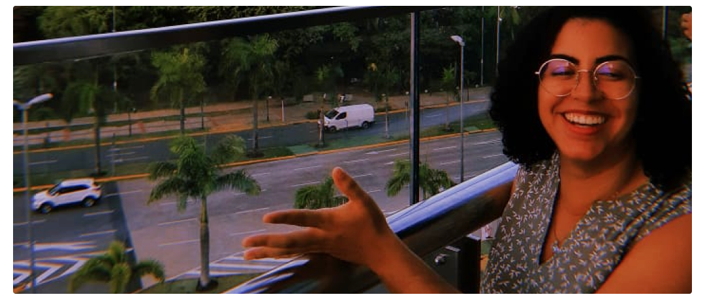

[← Home](/index)

 

# Who I am
Hello and welcome here!

I’m Lais, someone who believes that willing people can always make this world better.

Motivated by the curiosity to learn and explore new things, I see challenges as an opportunity to growth and go further. Regarding the behavioral perspective, I value the active listening and open communication to always make things clear and manage issues.

My work dynamics is guided by strategic perspectives, such as dedication, self-management, organization, proactivity, collaboration, assertive communication and attention to detail. That's how I help people and businesses to get achievements.

I've always seen technology as an instrument for connecting people and their needs.

During my academic time, I worked as a researcher, developing studies about Interaction Design in the Library and Information Science context. After graduation, I studied more about Product Design, in order to achieve a career transition, which didn't happen. 

In the half of last year, I was accepted for a job as a Technical Writer, my first work experience in the IT field, which gave me the opportunity to develop Documentation skills.

As I understand that every opportunity to learn is the basis for human development, I'm sure that all these experiences helped me to become a multidisciplinary professional.

At this moment, my main professional goals are:
- Being known and recognized for the quality of my work.
- Building a career capable of taking me anywhere in the world. 
- Helping others through my knowledge and experience.

So, since I've had experience working in mutiple fields so far, I believe this gathering of skills makes me a very authentic IT professional, making me someone strongly able to provide great contributions to any team I'll be part of.

 

[↑ Back to Top](index.md)