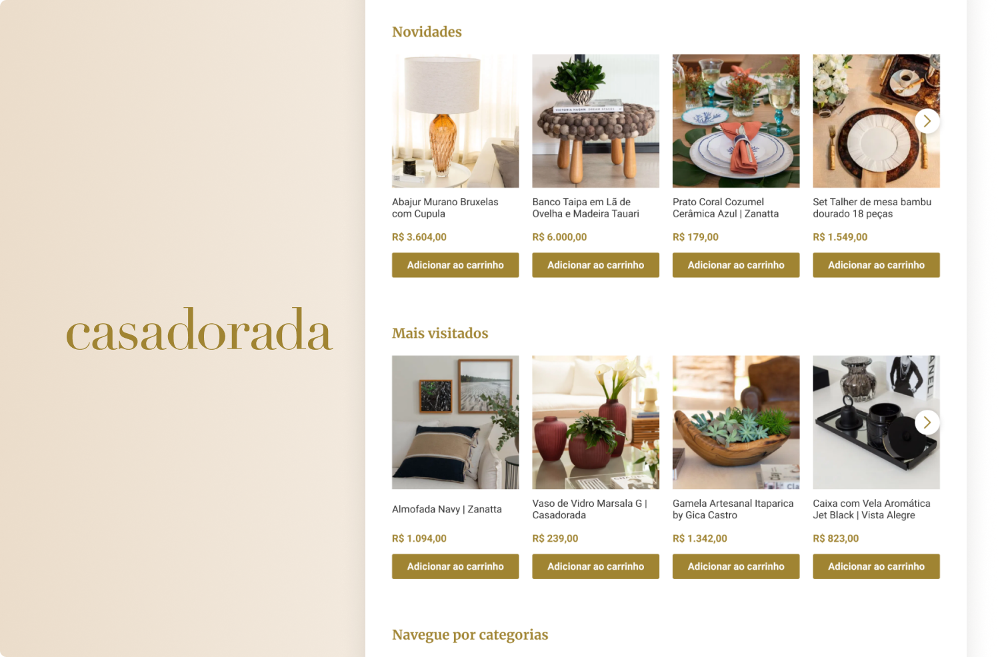
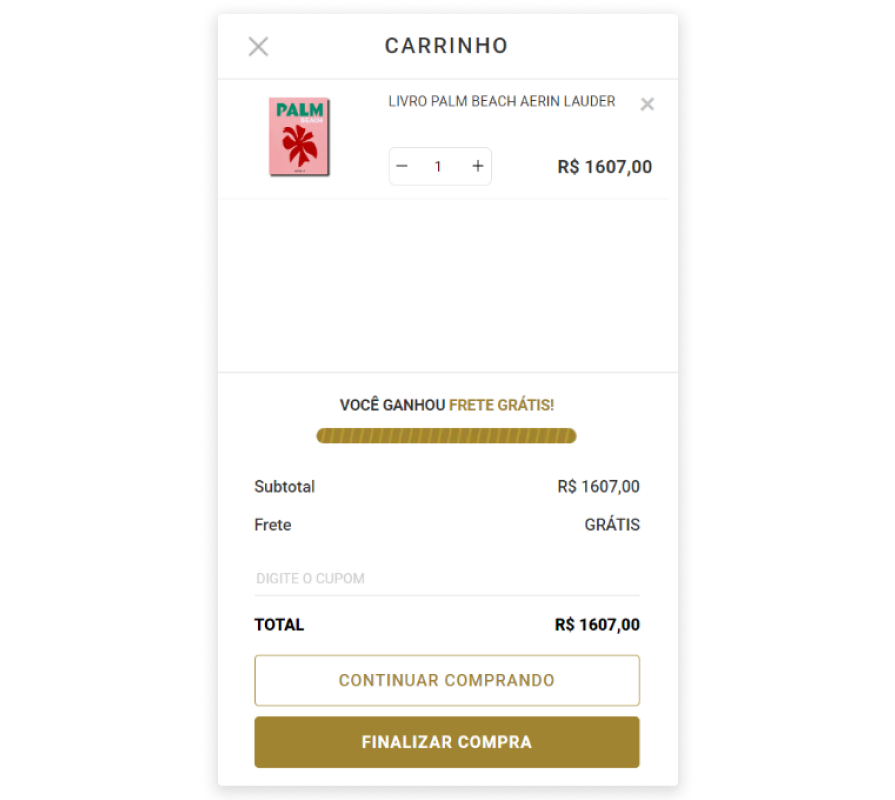
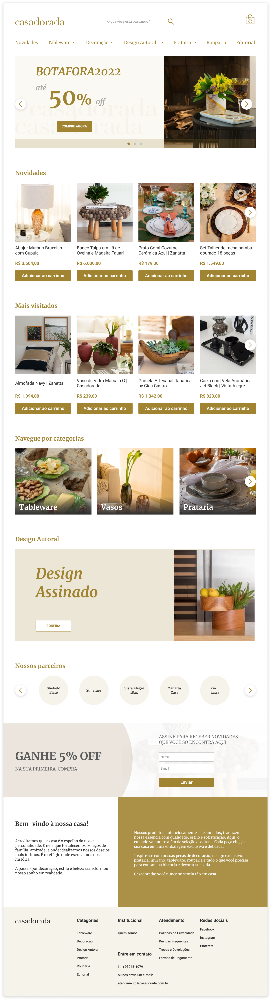
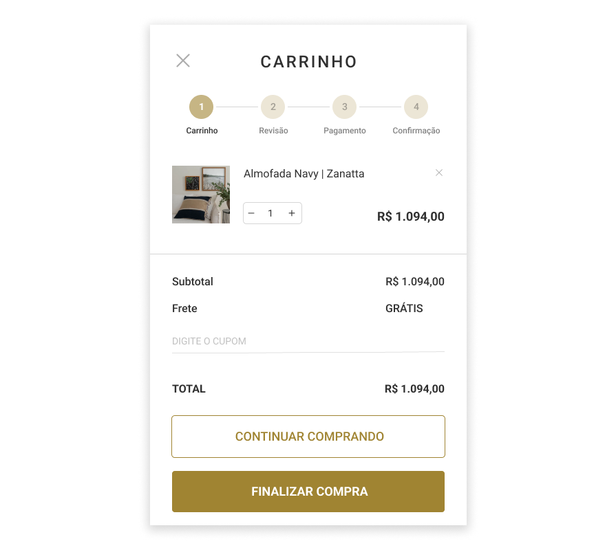
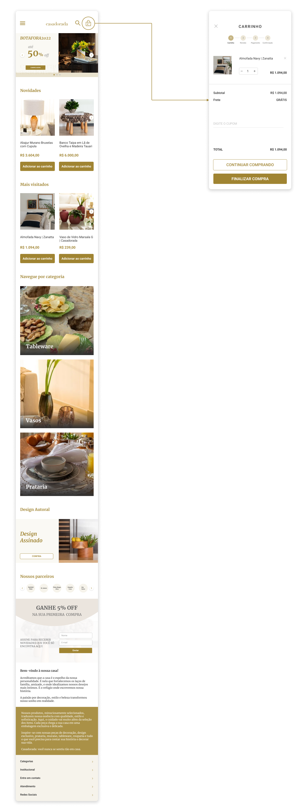

[← Design](/design/index)

 

# 🪞 Casadorada Website Redesign

## Overview
Redesign proposal for the Casadorada store website designed that was delievered as a challenge for a UX/UI Design job apply.

## My Role
- UI Design
- Prototyping

### Tools
- Figma

## The Problem
At the time, the store was being affected by a drop in their sales, and it was necessary to take an action to change this scenario.

## The Challenge
As I didn't have enough time or access to more information to explore the problem, I made an analysis of the current UI Design to think about what could be improved to the user experience, considering the visual aspect of the website.

::: info <infoblocktitle>🌐 Check out the website</infoblocktitle>
<infoblocktext>The current website design can be checked at </infoblocktext>[Casadorada](https://www.casadorada.com.br/).
:::

I was requested to redesign the **Homepage** and the **Mini Cart** of the website.

### Homepage ∙ Before

 

### Mini Cart ∙ Before

 

In my review, I noticed that some usability heuristics hadn't been applied to the pages. So I tried to think in that direction.

## Redesigned Points
### Homepage
- Removing of the four items next to the Search Bar to contained in this section, in order to reduce the cognitive load for the user.
- In the navigation items, I added an pointed down outlined chevron, to indicate the more options that are displayed while hovering.
- Adding of more contrast to the arrows on the carousel banner, so the user can easily view and move to the previous or next slide.
- Rearranging of sections, positioning the "Novidades" section right after the carousel to motivate the user to check what's new in the store.
- Repositioning of the information about price of the product and the button "Adicionar ao carrinho" to bring a better visual hierarchy to the interface.
- Changing colors of the discount banner to provide more constrast and a better arrangement to the Input elements.
- On the "About the Store" section, I divided it in two columns in order to include more contrast, to provide better distribution of the text and improve the reading experience.

### Mini Cart
- Displaying of the purchase steps to the user, in order to attend the "Visibility of system status" heuristic.

On the following topic, you can check out my redesign proposal for this website.

## Final Redesign
### Web Layout

 

### Mobile Layout

 

[↑ Back to Top](index.md)