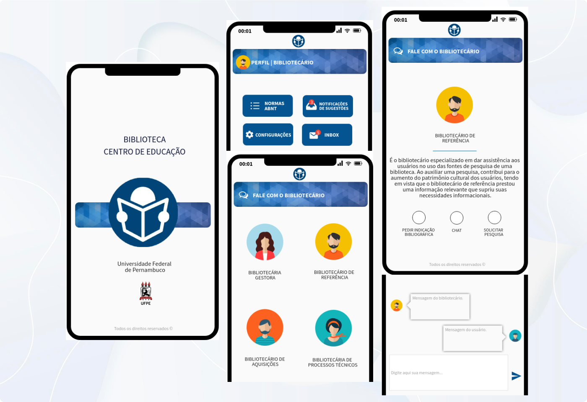
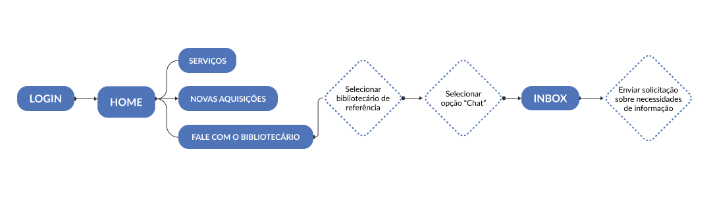
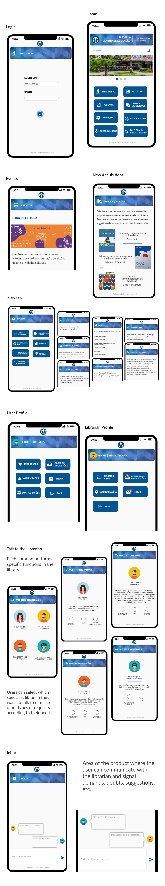

[← Design](/design/index)

 

# 📚 Innovation in the Reference Services of Libraries

## Overview
Reference service is an activity carried out by librarians in information environments, which consists in supporting users in their information needs, in order to promote access, dissemination and use of information.

This project was an academic team work that resulted in a case study made in an academic library. At the time, an information product proposal were designed to improve the communication between the library's Reference Service and the academic community.

## My Role
- Research
- Prototyping

## Project Goal
Knowing the existence of Reference Services and propose a new product or service that may help the development of the library and in achievement of its mission.

## People Involved
### Librarians

The Education Center Library of the university is an information environment that provides information services to the academic community, which includes:

- Bibliographic materials consultation.
- Loan, reservation and return of materials.
- Cataloguing.
- Guidance on academic work standardization.
- Services for people with special needs or other accessibility approaches.

### Users

As a part of academic routine, users usually go to the library for:

- Reading.
- Internet access.
- Group meetings.
- Bibliographic materials consult.
- Loan and return of materials.

## Research
A survey was applied to the library users to understand what they do when they need to access and use bibliographic information.

- 45% of the users said that, when they can't find a book, they look for it in another library.
- Only 18% of them ask librarians for help to get what they need.

Analyzing the data obtained in the interview with the librarian, the team discovered that:

- The library didn't have a channel for take suggestions, complaints or compliments from the users.

So, we thought and designed a solution for that issue.

## The Product

Our product is a channel designed to facilitate communication between library users and the library management, allowing users to signal their demands and provide feedback about their experience using the library products and services.

## User Flow

## Final Design

 

[↑ Back to Top](index.md)