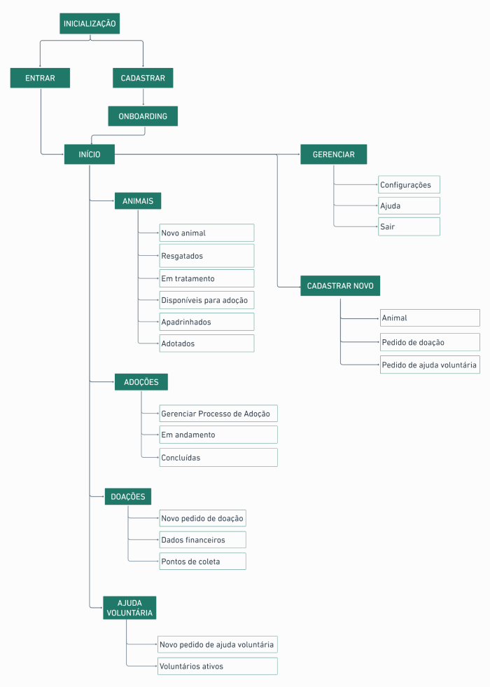

[← Design](/design/index)

 

# 🐾 Pet Aid

## Overview
This case study was a personal project that aimed to design a solution for a real problem of NGOs and Animal Shelters.

## My Role
Only designer in the project, I was responsible for the entire Design process, performing the following activities:

- UX Research
- Journey Mapping
- Competitive Analysis
- Ideation
- Information Architecture
- Wireframing
- Prototyping

### Tools
- Notion
- Google Sheets
- Maze
- Figma

## The Problem
Everyday, people who work in NGOs and animal shelters need to carry out specific activities such as manage animals, follow up on adoption processes, check the institution's needs and seek forms of support that help meet these needs. But currently, they work with multiple tools to carry out these activities.

## The Challenge
Due to the amount of activities demanded at NGOs and Shelters, the challenge was to centralize activity management in a single tool, and help users to save work time.

## Top Insights
After analyzing the survey and user interview data, I got some insights that helped me to define relevant pain points in the aspect of volunteer work:

- They need to use multiple tools to manage main activities of their work as volunteers.
- Due the lack of voluntary support, volunteers have been overwhelmed by the time demanded in their activities.
- Some people pointed out difficulties in managing time due many activities required by volunteer work.

Through these insights, I noticed that:

- People who work voluntarily in NGOs and shelters have pain points in relation to time management in the journey of carrying out their activities.

## Sketches

## Sitemaps
### Web

 

### Mobile

## User Flow
### Web

 

### Mobile

## User Testing
To test people's interaction with the product, I worked with Figma to build the Mid-Fidelity Wireframes and define the interactions, and with Maze to apply two unmoderated usability tests. The tests were carried out in order to achieve the following goals:

- Identify usability issues.
- Validate the navigation flow.
- Validate information architecture and information findability in the interface.
- Analyze user experience with textual product content.

The tests were carried out with 10 users, 5 on a Web device and 5 on a Mobile device. To analyze the results, I worked with Google Sheets to organize the data and used Notion to document the results.

Even though most users were able to complete the tasks, the feedbacks and analysis of the results helped me to note points that required relevant iterations to improve the product's usability.

## Style Guide
With the iterations applied from results of the usability tests, I defined the visual composition of the product and designed the interfaces.

## Final Design
### Web Layout

### Mobile Layout

## Prototyping

## Next Steps
Considering future updates to the product, I believe some ideas with potential to be implemented are:

- Usability testing with the high fidelity prototype.
- Generating of links to receive donations.
- Area for receive proposals for partnerships with companies in the animal segment.
- A feature for receiving and sending direct messages between the institution and adopters.
- Possibility of creating an online page for the NGO or Shelter as a connection channel with people interested in support the animal cause.

## What I've learned
- Defining goals before taking any action is fundamental for decision-making in a project.
- Actively listening to users and testing is the best way to validate solutions.
- Research process is essential for the design of an effective solution, as the initial challenge will not always be the real problem faced by the people involved in the explored context.
- Features prioritization is important to move the project forward.
- Applying  Information Architecture helps to design better interfaces and should always be considered not just as a project topic, but a practice that impacts the user experience directly.
- User testing brings perception from users in relation to the product, and can broad the design perspective in a unique way.
- All data and processes of a project must be effectively organized and documented.

 

[↑ Back to Top](index.md)