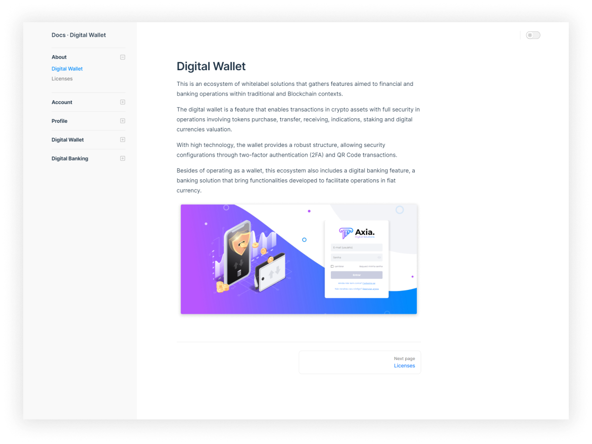
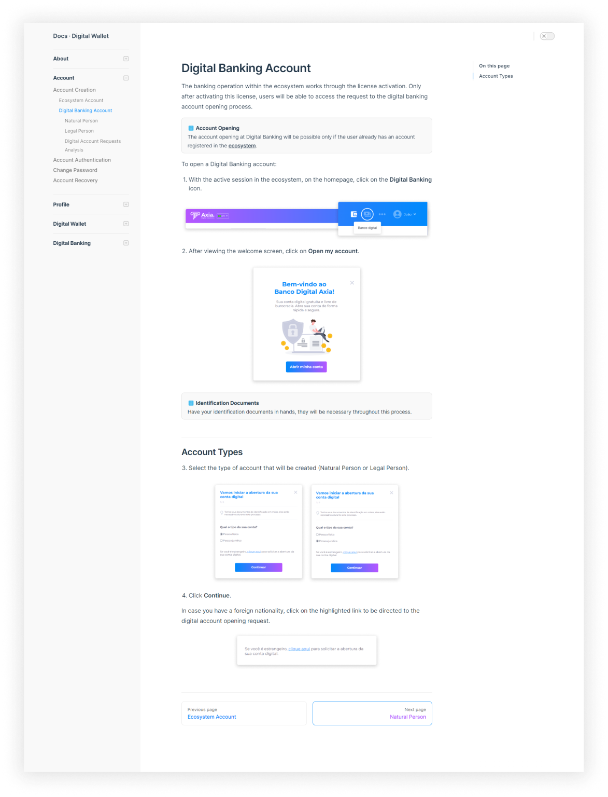

[← Documentation](/documentation/index)

<br>

# 💵 Digital Wallet


## Overview
This documentation was developed in order to communicate Axia's financial white label product and improve the customer experience and their users.

## My Role
Only Technical Writer in the company, I was responsible for the entire documentation process, gathering and analyzing complex information about the product from multiple sources, such as feature cards, technical requirements, taking questions to the Product, Technology and QA team, and exploring the product navigation.

### Skills
- Information Architecture
- Development Configuration
- Technical Writing

### Tools
- Notion
- Figma
- Visual Studio Code

## Docs as Code
Oriented by Docs as Code approach, all documentation was maintained in repositories that were constantly updated from local to the remote environment through Git.

### Documentation Repository Standard
In order to maintain an organized development environment, I defined a naming standard for the documentation folders and files.

### Markdown Files Naming
For Markdown files, I adopted the following structure standard:

```
<Structure Standard>
/Product.Documentation.Core
    /docs
        /language
            /versionfolder
                /sectionfolder
                    file.md

<Standard Applied>
/Wallet.Documentation.Core
    /docs
        /en
            /v_ongoing
                /account
                    changepassword.md
```

Using the relative path, the anchor for a Markdown file into the code was written like that:

```
<Structure Standard>
[Link Name](../sectionfolder/filename.md)

<Standard Applied>
[Change Password](../account/changepassword.md)
```

This method brough great results to the documentation process and to those who needed to access the repository, once the applying of this standard provided a better findability of files, and also made the code cleaner.

### Image Files Naming
```
< Structure Standard>
/Product.Documentation.Core
    /docs
        /language
            /versionfolder
                /img
                    /imgsectionfolder
                        sectionname_filename.png

<Standard Applied>
/Wallet.Documentation.Core
    /docs
        /en
            /v_ongoing
                /img
                    /account
                        account_changepassword.png
```

Using the relative path, the anchor for an image file into the code was written like that:


```
<Standard>


<Standard Applied>

```

## Information Architecture
To structure the docs navigation, I made a deep analysis of the product and I focused on the visual hierarchy of the interface, so the documentation users could follow the topics in the same logic order than what they were viewing in the product.


### Navigation
I usually think about something I learned from a Technical Writing teacher:

> The documentation is the mirror of the product. {.quote}

 So, in the process of defining the information hierarchy in the navigation and page content structuring, I considered the same hierarchy which I analyzed in the product, in order to lead documentation users in the same direction as the information displayed in the UI.


### Page Content Structuring


## Final Documentation
Here's the results of Digital Wallet documentation:

### Homepage


### About ∙ Digital Wallet


### About ∙ Licenses


### Account Creation ∙ Digital Banking


<br>

[↑ Back to Top](index.md)